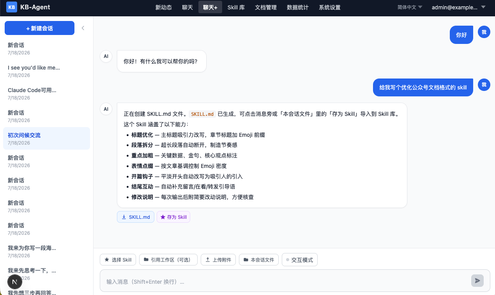
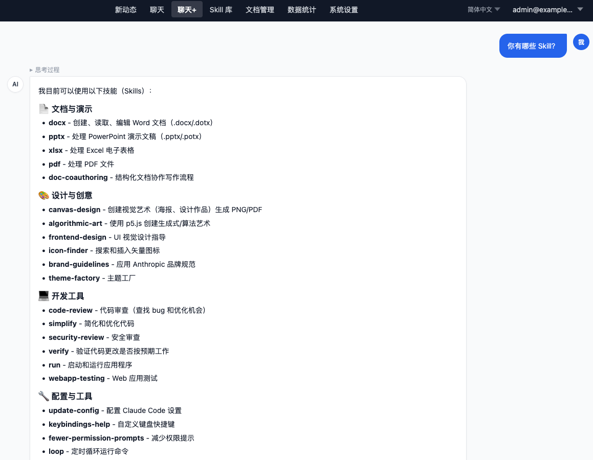
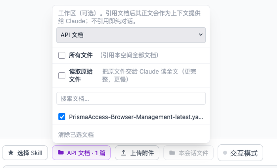
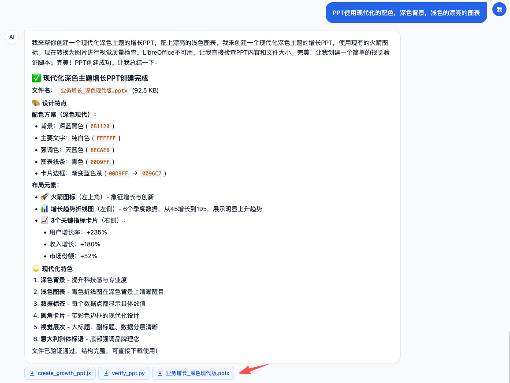
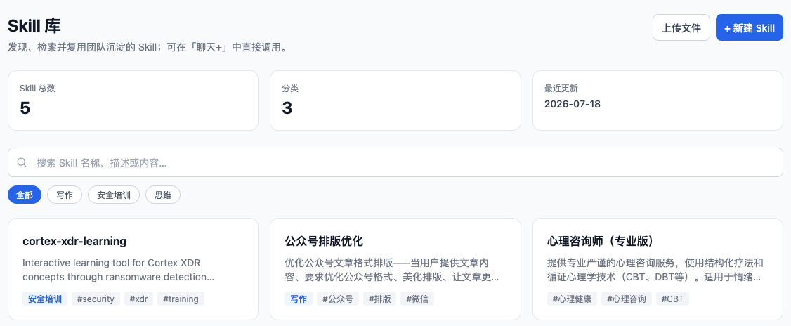

# KB-Agent 用户手册（2.0）

2.0 版本在原有「对话检索 + 文档库 + 新动态」的基础上，新增了两大能力：

- **聊天+**：一个更像 Claude Desktop 的智能工作台。除了问答，它还能调用 Skill、引用知识库文档、上传文件、执行任务并生成可下载的成果文件（如 PPT、Excel、报告），任务在后台运行、离开页面也不中断。
- **Skill 库**：一个可检索的能力卡片中心。你可以上传、搜索、下载 Skill（单个 `SKILL.md` 或含脚本/模板的 `.zip`），并在聊天+ 里随时启用它们，让 AI 具备专项技能（如生成 RFP、查找图标、制作图表）。

> 1.0 的基础功能（注册登录、对话、文档库、新动态、账户设置）请参见 [USER-1.0.md](./USER-1.0.md)，本手册只介绍 2.0 的新增内容。

---

## 目录

1. [聊天+ 智能工作台](#1-聊天-智能工作台)
2. [在聊天+ 中使用 Skill](#2-在聊天-中使用-skill)
3. [引用知识库文档](#3-引用知识库文档)
4. [上传文件与下载成果](#4-上传文件与下载成果)
5. [后台运行与实时续接](#5-后台运行与实时续接)
6. [交互模式与读取原文](#6-交互模式与读取原文)
7. [把成果存为 Skill](#7-把成果存为-skill)
8. [Skill 库](#8-skill-库)
9. [常见问题](#9-常见问题)

---

## 1. 聊天+ 智能工作台

点击顶部导航栏的「**聊天+**」进入。它与普通「对话」的区别在于：普通对话只做知识库问答，而聊天+ 是一个能**动手完成任务**的工作台——它可以运行代码、生成文件、调用专项技能。

聊天+ 的会话与普通对话**相互独立**，各自有自己的历史列表。

界面构成：

- **左侧**：会话列表，可新建、重命名、置顶、删除。正在后台生成的会话会显示一个跳动的小圆点。
- **中间**：对话区，逐字流式显示 AI 的思考过程与回答。
- **底部工具栏**：Skill 选择、文档引用、文件上传、本会话文件等入口。

---

## 2. 在聊天+ 中使用 Skill

Skill 是一份「操作说明书」，告诉 AI 如何完成某类专项任务。启用后，AI 在回答时会自动遵循该 Skill 的方法。

1. 在底部工具栏点击「**Skill**」选择器（平台也有一些预置 Skill，直接对话即可自动调用）。
2. 从列表中勾选一个或多个 Skill。
3. 正常提问即可，AI 会结合所选 Skill 的能力来完成任务。

所选 Skill 会**保存到当前会话**，下次回到该会话仍然有效；新建会话则重置。

---

## 3. 引用知识库文档

聊天+ 可以让 AI 参考知识库里的指定文档来作答，而不仅凭通用知识。

1. 在底部工具栏点击「**文档**」入口。
2. 先选择一个**空间**，再勾选要引用的具体文档；也可以选「引用全部文档」；如果想要将原始文档给 AI，需要勾选「读取原始文件」，默认只会将 AI 预处理后的正文喂给 AI。
3. 提问时 AI 会结合这些文档的内容作答。

> 文档引用是**每轮临时的上下文**，切换会话或新建会话后会重置为「不引用」，不会长期绑定。

---

## 4. 上传文件与下载成果

### 4.1 上传文件

在底部工具栏点击「**附件**」，选择本地文件上传（如一份需要处理的 Excel、一张图片）。AI 会读取这些文件并据此作答或处理。

### 4.2 下载 AI 生成的成果文件

当 AI 完成任务并生成了文件（如 PPT、Excel、Word、报告），这些文件会以**成果卡片**的形式出现在回答下方，点击即可下载。

同一会话里生成的所有文件，也可以通过工具栏的「**本会话文件**」面板统一查看和下载。

> 系统会自动过滤掉运行过程中的临时文件（如 `node_modules`、缓存目录等），只把真正的成果文件展示给你。

---

## 5. 后台运行与实时续接

聊天+ 的复杂任务（如生成一份完整 PPT）可能耗时较长。为此：

- **离开不中断**：你发起任务后即使切换到别的页面、或关闭当前标签，**任务仍在后台继续运行**并会在完成时保存结果。
- **返回自动续接**：回到该会话时，如果任务还在进行，界面会**自动重新连接**，从已生成的部分继续逐字显示；如果已经完成，直接显示完整结果。
- **侧边栏提示**：正在生成的会话，在左侧列表会显示一个跳动的小圆点。
- **随时停止**：点击输入框旁的「停止」按钮可主动中止生成，已生成的部分会被保留。

---

## 6. 交互模式与读取原文

底部工具栏提供两个**每轮临时**的开关（不持久化）：

- **交互模式**：开启后，当你的需求不够明确时，AI 可以**主动弹出选项**让你澄清（例如「你要哪种风格的 PPT？」），点击选项即可继续，减少反复来回。
- **读取原始文件**：开启后，引用知识库文档时，AI 会读取文档的**原始文件全文**（而非仅摘要），适合需要精确细节的场景。

---

## 7. 把成果存为 Skill

如果 AI 生成的某个文件（尤其是一份 `SKILL.md` 或技能包）值得复用，你可以把它**一键存入 Skill 库**：

1. 在成果文件卡片上点击「**存为 Skill**」。
2. 系统会自动解析文件里的名称、描述、分类、标签等信息并预填到弹窗中。
3. 确认或修改后保存，该 Skill 即出现在 Skill 库中，供全平台或你自己后续使用。

> 「存为 Skill」需要你具备 Skill 写入权限（由管理员分配）。

---

## 8. Skill 库

点击顶部导航栏的「**Skill 库**」进入。这里以卡片形式集中展示所有可用的 Skill，支持检索、上传和下载。

### 8.1 检索与浏览

- 顶部搜索框按名称/描述关键词检索。
- 卡片显示 Skill 的名称、描述、分类与标签；含附属文件（脚本、模板等）的 Skill 会有「📦 含附属文件」标记。

### 8.2 上传 Skill

点击「**上传**」，可上传：

- 单个 **`SKILL.md`** 文件（纯文本技能说明）；
- **`.zip` / `.skill`** 压缩包（内部必须包含一个 `SKILL.md`，可附带 Python 脚本、参考资料、模板等附属文件）。

上传时系统会自动解析 `SKILL.md` 里的名称、描述、分类、标签。上传 Skill 需要写入权限。

> **标准要求**：单文件必须命名为 `SKILL.md`（不区分大小写）；压缩包文件名不限，但内部必须含 `SKILL.md`。

### 8.3 下载 Skill

在任意 Skill 卡片上点击「**下载**」。含附属文件的 Skill 会下载完整的压缩包（包含脚本等所有文件），纯文本 Skill 则下载 `SKILL.md`。

### 8.4 在聊天+ 中调用附属文件

当你在聊天+ 里启用一个带附属文件的 Skill 时，它的脚本、模板等会被自动解包到会话的工作目录，AI 可以直接运行或读取它们（例如运行随包附带的 Python 脚本）。

---

## 9. 常见问题

**Q：看不到「聊天+」或「Skill 库」菜单？**
菜单是否显示取决于管理员为你分配的权限。若缺少相应权限，请联系管理员开通「聊天+」（chatplus）或「Skill 库」（skills）权限。

**Q：聊天+ 和普通「对话」有什么区别？**
普通对话只做知识库问答；聊天+ 是能动手完成任务的工作台，可调用 Skill、处理文件、生成可下载成果，任务还能后台运行。两者的会话历史相互独立。

**Q：任务生成到一半我关了页面，结果会丢吗？**
不会。任务在后台继续运行并保存结果，返回该会话即可看到完整结果或续接进度。（注意：服务器重启等极端情况下，进行中的任务可能丢失。）

**Q：思考过程离开后还能看到吗？**
返回会话时会补回离开前的思考过程与已生成的答案，并继续实时显示后续内容。

**Q：iconfont 等来源的图标能商用吗？**
图标查找 Skill 默认优先使用 iconfont，其图标多为个人上传，**商用请自行确认授权**；对合规敏感的正式对外材料，建议选用开源图标源。
