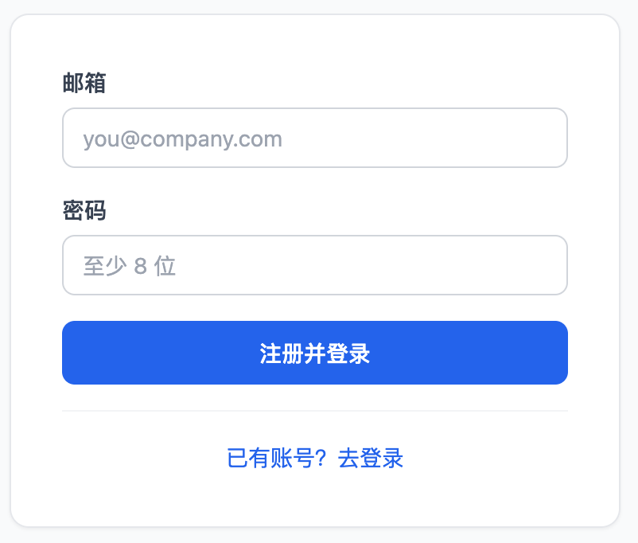
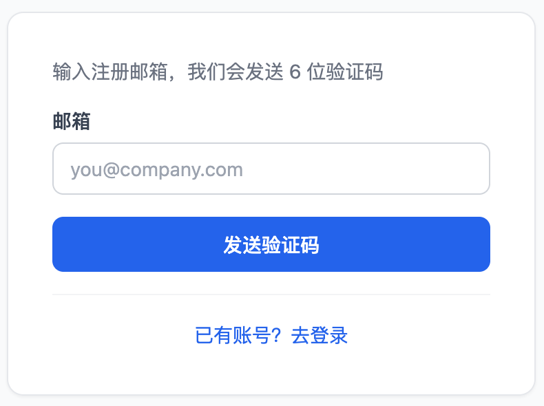
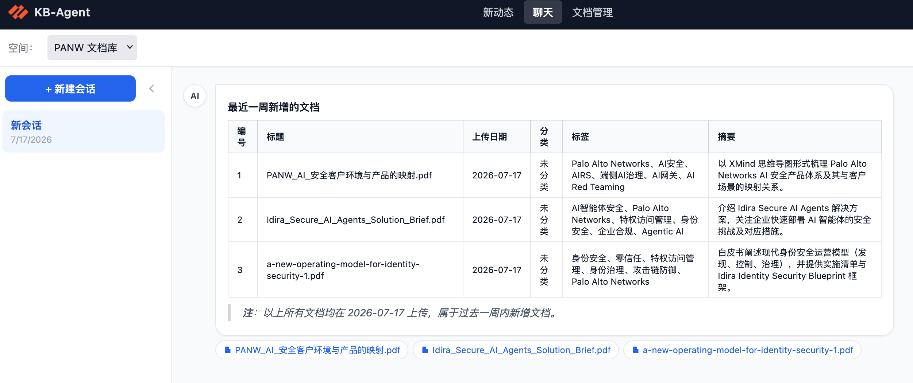
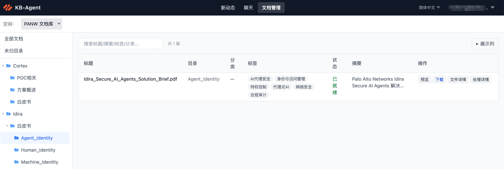
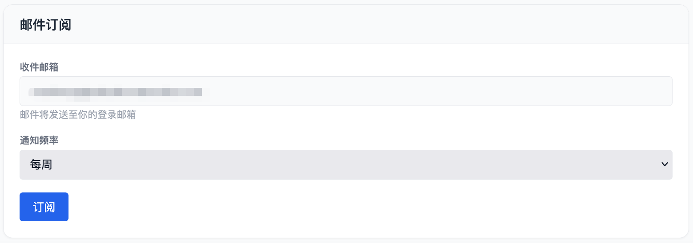

# KB-Agent 用户手册

KB-Agent 是一个面向团队的 AI-Native 知识管理与协同平台。管理员将文档上传至平台后，AI 会自动为每份文档生成摘要、分类和标签；你可以通过自然语言对话找到所需内容，也可以直接浏览文档库、预览文件和下载原文。2.0 版本进一步提供了「聊天+」智能工作台与 Skill 库，让 AI 能够调用专项技能、处理附件、生成可下载成果，并与团队共享复用这些能力。

---

## 目录

1. [注册与登录](#1-注册与登录)
2. [界面概览](#2-界面概览)
3. [通过对话查找资料](#3-通过对话查找资料)
4. [浏览与查阅文档](#4-浏览与查阅文档)
5. [新动态：跟进知识库更新](#5-新动态跟进知识库更新)
6. [聊天+ 智能工作台](#6-聊天-智能工作台)
7. [在聊天+ 中使用 Skill](#7-在聊天-中使用-skill)
8. [引用知识库文档](#8-引用知识库文档)
9. [上传文件与下载成果](#9-上传文件与下载成果)
10. [后台运行与实时续接](#10-后台运行与实时续接)
11. [交互模式与读取原文](#11-交互模式与读取原文)
12. [把成果存为 Skill](#12-把成果存为-skill)
13. [Skill 库](#13-skill-库)
14. [账户设置](#14-账户设置)
15. [常见问题](#15-常见问题)

---

## 1. 注册与登录

### 1.1 注册账号

平台采用邮箱白名单制度——只有使用公司/合作伙伴指定域名的邮箱才能注册，确保数据安全。

1. 在浏览器中打开平台地址，点击「注册」。
2. 输入你的工作邮箱和密码（密码至少 8 位，建议包含字母与数字）。
3. 点击「注册」提交。
4. 注册成功后，系统会向你的邮箱发送一封验证邮件。打开邮件，点击其中的验证链接，完成邮箱验证。
5. 验证完成后即可返回登录页面登录。

> **注意**：在完成邮箱验证之前无法登录。如果没有收到验证邮件，请检查垃圾邮件文件夹；若仍未收到，请联系管理员。
>
> 如果提示「该邮箱域名不在允许范围内」，说明你的邮箱域名尚未加入白名单，请联系管理员添加。

### 1.2 登录

1. 输入注册时使用的邮箱和密码，点击「登录」。
2. 登录成功后进入首页（新动态页）。

### 1.3 忘记密码

1. 在登录页点击「忘记密码」。
2. 输入注册邮箱，点击「发送验证码」。平台会向该邮箱发送一个 6 位数字验证码，有效期 10 分钟。
3. 输入验证码和新密码，点击「重置密码」即可。

> 每个邮箱每分钟只能发送一次验证码；连续 5 次输入错误验证码后需重新发送。

---

## 2. 界面概览

登录后，顶部导航栏提供以下入口（实际显示取决于管理员为你分配的权限）：

| 菜单项 | 说明 |
|--------|------|
| 新动态 | 查看最近的文档变动摘要，订阅邮件推送 |
| 对话 | 通过自然语言向 AI 提问，检索知识库 |
| 文档 | 浏览、搜索、预览和下载文档 |
| 聊天+ | 智能工作台，可调用 Skill、处理文件、生成可下载成果 |
| Skill 库 | 检索、上传、下载 Skill 的能力卡片中心 |
| 管理（仅管理员可见） | 空间管理、用户管理、系统设置等 |

右上角可以切换界面语言和进入账户设置。

---

## 3. 通过对话查找资料

「对话」是最快速找到资料的方式。你不需要知道文档的名称或位置，只需用自然语言描述你的问题，AI 会在知识库中检索相关内容，并给出综合答案和原始来源。

### 3.1 选择知识库空间

平台将文档按「空间」隔离管理，你只能检索自己被授权访问的空间。进入对话页面后：

1. 在页面顶部的下拉框中选择你想查询的空间。
2. 如果只有一个空间，系统会自动选中。

### 3.2 提问

在底部输入框中输入你的问题，按 Enter 或点击发送按钮。

AI 回答由两部分组成：

**答案**：AI 综合知识库内容生成的文字答案，以 Markdown 格式排版，包含段落、列表、代码块等。

**来源文档**：答案下方会列出 AI 参考的文档，每个来源显示文档标题。点击「下载」可以获取原始文件。

---

## 4. 浏览与查阅文档

「文档」页面让你像浏览文件系统一样直接查阅知识库，适合在已知文档大致位置时快速定位，或者想系统了解某个分类下的所有内容。

### 4.1 切换空间与目录导航

1. 页面顶部选择空间。
2. 左侧「目录树」显示该空间的文件夹结构，点击文件夹展开/折叠，点击文件夹名称过滤右侧列表。

### 4.2 预览及下载文档

点击文档行右侧的「预览」按钮，在浏览器内直接查看文件内容。

另外点击「文件详情」也可以查看 AI 整理后的文件内容，包含摘要、正文等信息。

同时，点击右侧的「下载」按钮，即可下载原始文件。

---

## 5. 新动态：跟进知识库更新

「新动态」会定期汇总知识库中的最新内容变化，生成一份易读的摘要报告，让你不需要逐一翻阅文档，就能了解团队最近上传了什么、有哪些值得关注的新内容。

### 5.1 查看新动态

点击导航栏「新动态」，进入报告列表。每个空间的报告独立显示，包含：

- **报告时间**：该报告的生成时间
- **更新摘要**：AI 对这段时间内新增/更新文档的综合概述
- **文档列表**：涉及的具体文档，点击可跳转到文档详情

报告按时间倒序排列，最新的报告在最上方。

### 5.2 订阅邮件推送

如果你希望定期在邮箱收到知识库更新摘要，可以订阅邮件推送：

1. 进入「新动态」页面。
2. 点击右上角「订阅设置」。
3. 选择推送频率：
   - **每周**：每周发送一次
   - **每两周**：每两周发送一次
   - **每月**：每月发送一次
4. 点击「保存」。

订阅生效后，系统将按你选择的频率把更新摘要发送到你的注册邮箱。

### 5.3 取消订阅

在「订阅设置」中选择「不订阅」，保存后即可取消邮件推送。

---

## 6. 聊天+ 智能工作台

点击顶部导航栏的「**聊天+**」进入。它与普通「对话」的区别在于：普通对话只做知识库问答，而聊天+ 是一个能**动手完成任务**的工作台——它可以运行代码、生成文件、调用专项技能。

聊天+ 的会话与普通对话**相互独立**，各自有自己的历史列表。

界面构成：

- **左侧**：会话列表，可新建、重命名、置顶、删除。正在后台生成的会话会显示一个跳动的小圆点。
- **中间**：对话区，逐字流式显示 AI 的思考过程与回答。
- **底部工具栏**：Skill 选择、文档引用、文件上传、本会话文件等入口。

---

## 7. 在聊天+ 中使用 Skill

Skill 是一份「操作说明书」，告诉 AI 如何完成某类专项任务。启用后，AI 在回答时会自动遵循该 Skill 的方法。

1. 在底部工具栏点击「**Skill**」选择器（平台也有一些预置 Skill，直接对话即可自动调用）。
2. 从列表中勾选一个或多个 Skill。
3. 正常提问即可，AI 会结合所选 Skill 的能力来完成任务。

所选 Skill 会**保存到当前会话**，下次回到该会话仍然有效；新建会话则重置。

---

## 8. 引用知识库文档

聊天+ 可以让 AI 参考知识库里的指定文档来作答，而不仅凭通用知识。

1. 在底部工具栏点击「**文档**」入口。
2. 先选择一个**空间**，再勾选要引用的具体文档；也可以选「引用全部文档」；如果想要将原始文档给 AI，需要勾选「读取原始文件」，默认只会将 AI 预处理后的正文喂给 AI。
3. 提问时 AI 会结合这些文档的内容作答。

> 文档引用是**每轮临时的上下文**，切换会话或新建会话后会重置为「不引用」，不会长期绑定。

---

## 9. 上传文件与下载成果

### 9.1 上传文件

在底部工具栏点击「**附件**」，选择本地文件上传（如一份需要处理的 Excel、一张图片）。AI 会读取这些文件并据此作答或处理。

### 9.2 下载 AI 生成的成果文件

当 AI 完成任务并生成了文件（如 PPT、Excel、Word、报告），这些文件会以**成果卡片**的形式出现在回答下方，点击即可下载。

同一会话里生成的所有文件，也可以通过工具栏的「**本会话文件**」面板统一查看和下载。

> 系统会自动过滤掉运行过程中的临时文件（如 `node_modules`、缓存目录等），只把真正的成果文件展示给你。

---

## 10. 后台运行与实时续接

聊天+ 的复杂任务（如生成一份完整 PPT）可能耗时较长。为此：

- **离开不中断**：你发起任务后即使切换到别的页面、或关闭当前标签，**任务仍在后台继续运行**并会在完成时保存结果。
- **返回自动续接**：回到该会话时，如果任务还在进行，界面会**自动重新连接**，从已生成的部分继续逐字显示；如果已经完成，直接显示完整结果。
- **侧边栏提示**：正在生成的会话，在左侧列表会显示一个跳动的小圆点。
- **随时停止**：点击输入框旁的「停止」按钮可主动中止生成，已生成的部分会被保留。

---

## 11. 交互模式与读取原文

底部工具栏提供两个**每轮临时**的开关（不持久化）：

- **交互模式**：开启后，当你的需求不够明确时，AI 可以**主动弹出选项**让你澄清（例如「你要哪种风格的 PPT？」），点击选项即可继续，减少反复来回。
- **读取原始文件**：开启后，引用知识库文档时，AI 会读取文档的**原始文件全文**（而非仅摘要），适合需要精确细节的场景。

---

## 12. 把成果存为 Skill

如果 AI 生成的某个文件（尤其是一份 `SKILL.md` 或技能包）值得复用，你可以把它**一键存入 Skill 库**：

1. 在成果文件卡片上点击「**存为 Skill**」。
2. 系统会自动解析文件里的名称、描述、分类、标签等信息并预填到弹窗中。
3. 确认或修改后保存，该 Skill 即出现在 Skill 库中，供全平台或你自己后续使用。

> 「存为 Skill」需要你具备 Skill 写入权限（由管理员分配）。

---

## 13. Skill 库

点击顶部导航栏的「**Skill 库**」进入。这里以卡片形式集中展示所有可用的 Skill，支持检索、上传和下载。

### 13.1 检索与浏览

- 顶部搜索框按名称/描述关键词检索。
- 卡片显示 Skill 的名称、描述、分类与标签；含附属文件（脚本、模板等）的 Skill 会有「📦 含附属文件」标记。

### 13.2 上传 Skill

点击「**上传**」，可上传：

- 单个 **`SKILL.md`** 文件（纯文本技能说明）；
- **`.zip` / `.skill`** 压缩包（内部必须包含一个 `SKILL.md`，可附带 Python 脚本、参考资料、模板等附属文件）。

上传时系统会自动解析 `SKILL.md` 里的名称、描述、分类、标签。上传 Skill 需要写入权限。

> **标准要求**：单文件必须命名为 `SKILL.md`（不区分大小写）；压缩包文件名不限，但内部必须含 `SKILL.md`。

### 13.3 下载 Skill

在任意 Skill 卡片上点击「**下载**」。含附属文件的 Skill 会下载完整的压缩包（包含脚本等所有文件），纯文本 Skill 则下载 `SKILL.md`。

### 13.4 在聊天+ 中调用附属文件

当你在聊天+ 里启用一个带附属文件的 Skill 时，它的脚本、模板等会被自动解包到会话的工作目录，AI 可以直接运行或读取它们（例如运行随包附带的 Python 脚本）。

---

## 14. 账户设置

点击右上角头像或邮箱，进入账户设置页面。

### 14.1 修改密码

1. 在账户设置页面找到「修改密码」。
2. 输入当前密码和新密码，点击「保存」。

> 修改密码后，当前登录状态保持有效，不需要重新登录。

### 14.2 注销账号

平台支持注销账号，注销后您的所有信息将被删除，请谨慎使用此功能。

---

## 15. 常见问题

**Q：看不到「聊天+」或「Skill 库」菜单？**
菜单是否显示取决于管理员为你分配的权限。若缺少相应权限，请联系管理员开通「聊天+」（chatplus）或「Skill 库」（skills）权限。

**Q：聊天+ 和普通「对话」有什么区别？**
普通对话只做知识库问答；聊天+ 是能动手完成任务的工作台，可调用 Skill、处理文件、生成可下载成果，任务还能后台运行。两者的会话历史相互独立。

**Q：任务生成到一半我关了页面，结果会丢吗？**
不会。任务在后台继续运行并保存结果，返回该会话即可看到完整结果或续接进度。（注意：服务器重启等极端情况下，进行中的任务可能丢失。）

**Q：思考过程离开后还能看到吗？**
返回会话时会补回离开前的思考过程与已生成的答案，并继续实时显示后续内容。

**Q：iconfont 等来源的图标能商用吗？**
图标查找 Skill 默认优先使用 iconfont，其图标多为个人上传，**商用请自行确认授权**；对合规敏感的正式对外材料，建议选用开源图标源。

---

> 如果在使用过程中遇到其他问题，请联系平台管理员或参考管理员文档。
