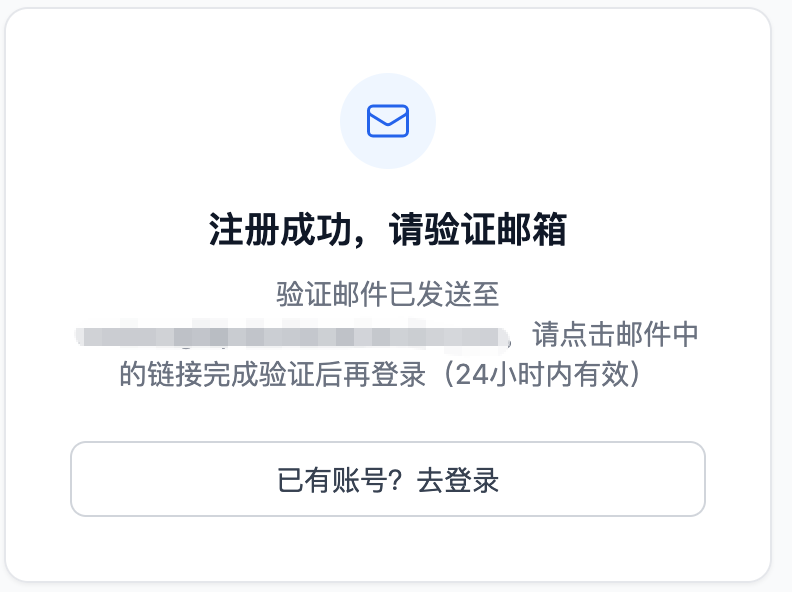
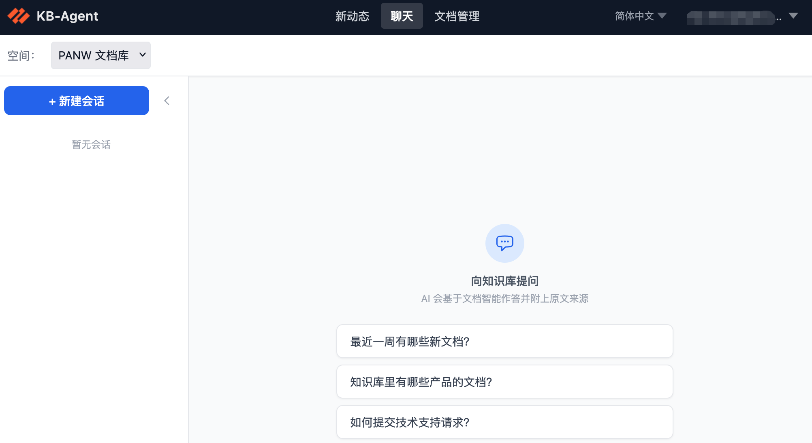
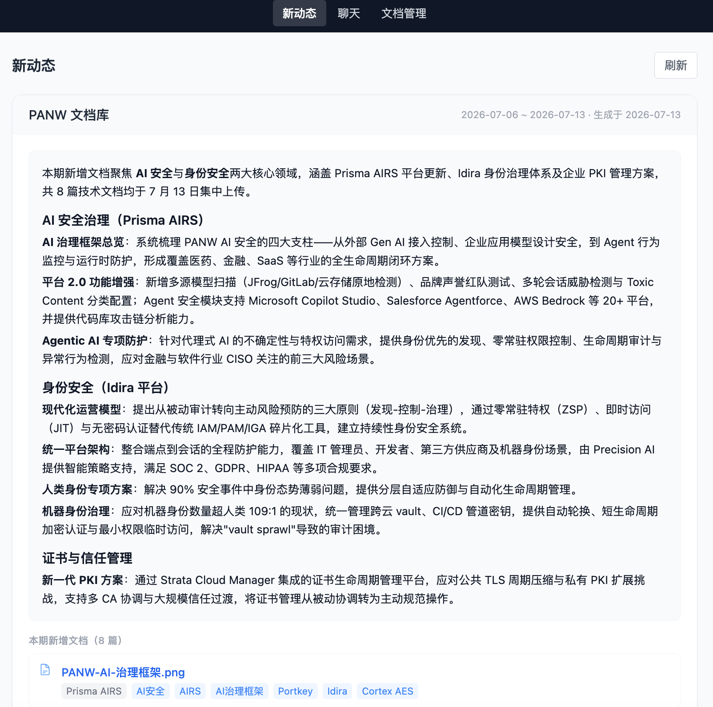

# KB-Agent 用户手册

KB-Agent 是一个团队知识平台。管理员将文档上传至平台后，AI 会自动为每份文档生成摘要、分类和标签；你可以通过自然语言对话找到所需内容，也可以直接浏览文档库、预览文件和下载原文，还可以订阅新动态，及时了解知识库的最新变化。

---

## 目录

1. [注册与登录](#1-注册与登录)
2. [界面概览](#2-界面概览)
3. [通过对话查找资料](#3-通过对话查找资料)
4. [浏览与查阅文档](#4-浏览与查阅文档)
5. [新动态：跟进知识库更新](#5-新动态跟进知识库更新)
6. [账户设置](#6-账户设置)

---

## 1. 注册与登录

### 1.1 注册账号

平台采用邮箱白名单制度——只有使用公司/合作伙伴指定域名的邮箱才能注册，确保数据安全。

1. 在浏览器中打开平台地址，点击「注册」。
2. 输入你的工作邮箱和密码（密码至少 8 位，建议包含字母与数字）。
3. 点击「注册」提交。
4. 注册成功后，系统会向你的邮箱发送一封验证邮件。打开邮件，点击其中的验证链接，完成邮箱验证。
5. 验证完成后即可返回登录页面登录。

> **注意**：在完成邮箱验证之前无法登录。如果没有收到验证邮件，请检查垃圾邮件文件夹；若仍未收到，请联系管理员。
>
> 如果提示「该邮箱域名不在允许范围内」，说明你的邮箱域名尚未加入白名单，请联系管理员添加。

### 1.2 登录

1. 输入注册时使用的邮箱和密码，点击「登录」。
2. 登录成功后进入首页（新动态页）。

### 1.3 忘记密码

1. 在登录页点击「忘记密码」。
2. 输入注册邮箱，点击「发送验证码」。平台会向该邮箱发送一个 6 位数字验证码，有效期 10 分钟。
3. 输入验证码和新密码，点击「重置密码」即可。

> 每个邮箱每分钟只能发送一次验证码；连续 5 次输入错误验证码后需重新发送。

---

## 2. 界面概览

登录后，顶部导航栏提供以下入口（实际显示取决于管理员为你分配的权限）：

| 菜单项 | 说明 |
|--------|------|
| 新动态 | 查看最近的文档变动摘要，订阅邮件推送 |
| 对话 | 通过自然语言向 AI 提问，检索知识库 |
| 文档 | 浏览、搜索、预览和下载文档 |
| 管理（仅管理员可见） | 空间管理、用户管理、系统设置等 |

右上角可以切换界面语言和进入账户设置。

---

## 3. 通过对话查找资料

「对话」是最快速找到资料的方式。你不需要知道文档的名称或位置，只需用自然语言描述你的问题，AI 会在知识库中检索相关内容，并给出综合答案和原始来源。

### 3.1 选择知识库空间

平台将文档按「空间」隔离管理，你只能检索自己被授权访问的空间。进入对话页面后：

1. 在页面顶部的下拉框中选择你想查询的空间。
2. 如果只有一个空间，系统会自动选中。

### 3.2 提问

在底部输入框中输入你的问题，按 Enter 或点击发送按钮。

AI 回答由两部分组成：

**答案**：AI 综合知识库内容生成的文字答案，以 Markdown 格式排版，包含段落、列表、代码块等。

**来源文档**：答案下方会列出 AI 参考的文档，每个来源显示文档标题。点击「下载」可以获取原始文件。

## 4. 浏览与查阅文档

「文档」页面让你像浏览文件系统一样直接查阅知识库，适合在已知文档大致位置时快速定位，或者想系统了解某个分类下的所有内容。

### 4.1 切换空间与目录导航

1. 页面顶部选择空间。
2. 左侧「目录树」显示该空间的文件夹结构，点击文件夹展开/折叠，点击文件夹名称过滤右侧列表。

### 4.2 预览及下载文档

点击文档行右侧的「预览」按钮，在浏览器内直接查看文件内容。

另外点击「文件详情」也可以查看 AI 整理后的文件内容，包含摘要、正文等信息。

同时，点击右侧的「下载」按钮，即可下载原始文件。

---

## 5. 新动态：跟进知识库更新

「新动态」会定期汇总知识库中的最新内容变化，生成一份易读的摘要报告，让你不需要逐一翻阅文档，就能了解团队最近上传了什么、有哪些值得关注的新内容。

### 5.1 查看新动态

点击导航栏「新动态」，进入报告列表。每个空间的报告独立显示，包含：

- **报告时间**：该报告的生成时间
- **更新摘要**：AI 对这段时间内新增/更新文档的综合概述
- **文档列表**：涉及的具体文档，点击可跳转到文档详情

报告按时间倒序排列，最新的报告在最上方。

### 5.2 订阅邮件推送

如果你希望定期在邮箱收到知识库更新摘要，可以订阅邮件推送：

1. 进入「新动态」页面。
2. 点击右上角「订阅设置」。
3. 选择推送频率：
   - **每周**：每周发送一次
   - **每两周**：每两周发送一次
   - **每月**：每月发送一次
4. 点击「保存」。

订阅生效后，系统将按你选择的频率把更新摘要发送到你的注册邮箱。

### 5.3 取消订阅

在「订阅设置」中选择「不订阅」，保存后即可取消邮件推送。

---

## 6. 账户设置

点击右上角头像或邮箱，进入账户设置页面。

### 6.1 修改密码

1. 在账户设置页面找到「修改密码」。
2. 输入当前密码和新密码，点击「保存」。

> 修改密码后，当前登录状态保持有效，不需要重新登录。

### 6.2 注销账号

平台支持注销账号，注销后您的所有信息将被删除，请谨慎使用此功能。
